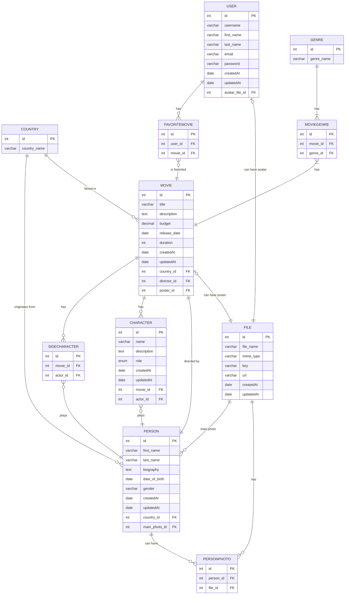

# Database-and-SQL

```mermaid
erDiagram
USER {
    int id PK
    varchar username
    varchar first_name
    varchar last_name
    varchar email
    varchar password
    date createdAt
    date updatedAt
    int avatar_file_id FK

}

FILE {
    int id PK
    varchar file_name
    varchar mime_type
    varchar key
    varchar url
    date createdAt
    date updatedAt
}

MOVIE {
    int id PK
    varchar title
    text description
    decimal budget
    date release_date
    int duration
    date createdAt
    date updatedAt
    int country_id FK
    int director_id FK
    int poster_id FK
}

COUNTRY {
    int id PK
    varchar country_name
}

CHARACTER {
    int id PK
    varchar name
    text description
    enum role
    date createdAt
    date updatedAt
    int movie_id FK
    int actor_id FK
}

SIDECHARACTER {
    int id PK
    int movie_id FK
    int actor_id FK
}

PERSON {
    int id PK
    varchar first_name
    varchar last_name
    text biography
    date date_of_birth
    varchar gender
    date createdAt
    date updatedAt
    int country_id FK
    int main_photo_id FK
}

PERSONPHOTO {
    int id PK
    int person_id FK
    int file_id FK
}

GENRE{
    int id PK
    varchar genre_name
}

MOVIEGENRE {
    int id PK
    int movie_id FK
    int genre_id FK
}

FAVORITEMOVIE {
    int id PK
    int user_id FK
    int movie_id FK
}


USER ||--o{ FAVORITEMOVIE : "has"
FAVORITEMOVIE }o--|| MOVIE: "is favorited"
FILE ||--o{ PERSON : "main photo"
FILE ||--o{ PERSONPHOTO : "has"
MOVIE ||--o{ SIDECHARACTER : "has"
SIDECHARACTER }o--|| PERSON : "plays"
COUNTRY ||--o{ PERSON : "originates from"
PERSON ||--o{ PERSONPHOTO : "can have"
COUNTRY ||--o{ MOVIE : "filmed in"
MOVIE ||--o{ CHARACTER : "has"
CHARACTER }o--|| PERSON : "plays"
MOVIE ||--|| PERSON : "directed by"
MOVIE |o--|| FILE : "can have poster"
USER |o--|| FILE : "can have avatar"
MOVIEGENRE }|--|| MOVIE : "has"
GENRE ||--|{ MOVIEGENRE : "has"
```
